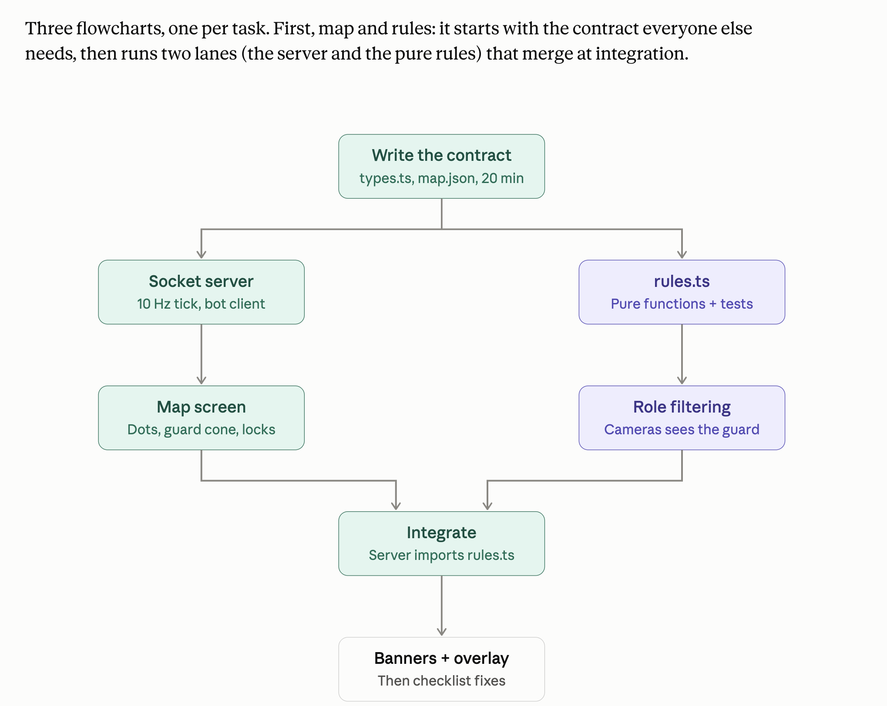
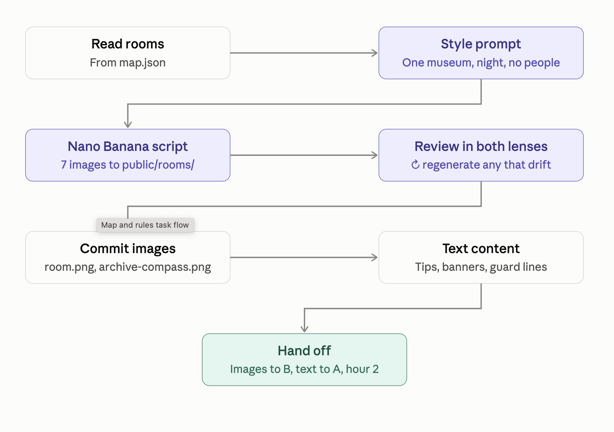
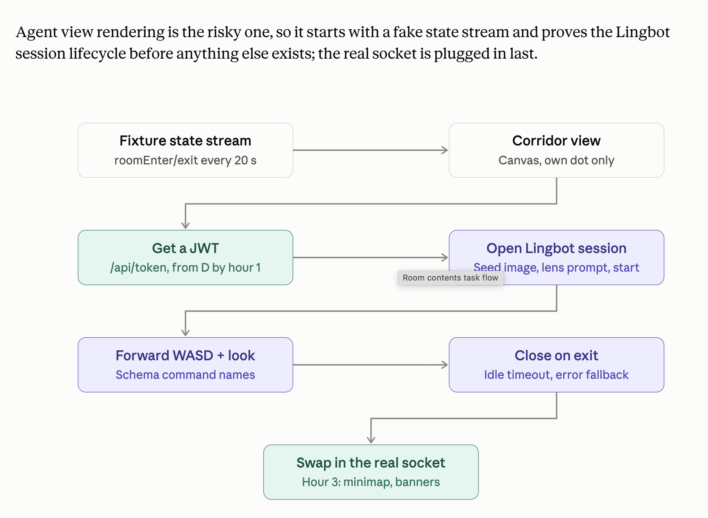

# Tasks — The Two Thieves (pass 1)

Pass 1 is three large tasks, plus a supporting lane for keys, integration and the
demo. Each task has a flowchart in [`plan/`](./plan/). The full spec is in
[`CLAUDE.md`](./CLAUDE.md).

| # | Task | People | Flowchart |
|---|---|---|---|
| 1 | Map and rules | A (server lane), C (rules lane) | [`plan/1-map-and-rules.png`](./plan/1-map-and-rules.png) |
| 2 | Room contents | C | [`plan/2-room-contents.png`](./plan/2-room-contents.png) |
| 3 | Agent view rendering | B | [`plan/3-agent-view-rendering.png`](./plan/3-agent-view-rendering.png) |
| — | Supporting: keys, auth, integration, demo | D | — |

## Handoffs at a glance

| When | Who → who | What |
|---|---|---|
| Minute 20 | A → everyone | `shared/types.ts` and `map.json` pushed; everyone pulls |
| Hour 1 | D → B | `/api/token` working |
| Hour 2 | C → A | `server/rules.ts` |
| Hour 2 | C → B | Seed images in `public/rooms/` |
| Hour 2 | C → A | Text content (tips, banners, guard lines) |
| Hour 2 | D → everyone | One-command dev script |
| Hour 3 | A → B | Running socket |
| Hour 3 on | D → everyone | Checklist runs and honest bug reports; D stops writing features |
| Hourly | Everyone | Branches rebased on `two-theives` |

---

## Task 1 — Map and rules

It starts with the contract everyone else needs, then runs two lanes (the
server and the pure rules) that merge at integration.

**Flow:** write the contract (`types.ts`, `map.json`, 20 min) → two lanes in
parallel → integrate (server imports `rules.ts`) → banners + overlay → checklist
fixes.

| Lane | Owner | Steps |
|---|---|---|
| Server | A | Socket server (10 Hz tick, bot client) → Map screen (dots, guard cone, locks) |
| Rules | C | `rules.ts` (pure functions + tests) → Role filtering (Cameras sees the guard) |

**Files:** `shared/types.ts`, `map.json`, `server/index.ts`, `server/rules.ts`
and its tests, `/map`.

### Step 1: the contract (A, first 20 minutes)

- Write `shared/types.ts` and `map.json`: 20 × 12 grid, 6 rooms, 2 exits,
  2 starts, guard route, compass room.
- Push, and tell everyone to pull.
- **These two files are the contract.** Announce any later change to them out
  loud before pushing.

### Server lane (A)

- Socket.IO on port 3001, a 10 Hz tick.
- A bot client to drive the server before the real play screen exists.
- State broadcast with per-role filtering (from the rules lane).
- Until `rules.ts` lands at hour 2, a stub that only moves dots.
- The map screen draws the floor plan from `map.json` on a canvas:
  - rooms, corridor, exits
  - two labeled dots
  - the guard dot with its three-cell cone
  - locked rooms hatched
  - the compass icon once found
  - the clock
  - a winner overlay

### Rules lane (C)

The rules are pure functions over `GameState`, with unit tests:

- movement and locked rooms
- guard patrol, one cell per second
- the vision cone and the catch (teleport to start, 30 s penalty)
- search succeeds only in the compass room after 5 s present
- the 180 s lock of the two rooms nearest the compass
- the 90 s alarm on pickup
- steal-back when both players are in one room
- win on exit, loss at zero

**Role filtering:** Cameras' payload includes the guard's position and facing
and Goggles' last corridor cell. Goggles' payload omits both.

### Integrate → banners + overlay → checklist fixes

- The server imports `rules.ts` **without changing its interface**.
- Wire banners (text from Task 2) and the winner overlay.
- Fix whatever D's checklist runs turn up.

**Done looks like:** two browsers join as different roles, the map shows both
dots moving and the guard patrolling, and state changes from the rules appear on
the map within one tick. `pnpm test` passes on the rules.

- [ ] `shared/types.ts` + `map.json` pushed (minute 20)
- [ ] Socket server, 10 Hz tick, bot client
- [ ] `/map` canvas: rooms, corridor, exits, dots, guard + cone, hatched locks, compass, clock
- [ ] `server/rules.ts` with all rules above; `pnpm test` passes (hour 2)
- [ ] Per-role state filtering
- [ ] Server imports `rules.ts`; stub removed
- [ ] Banners + winner overlay
- [ ] Socket ready for Task 3 (hour 3)
- [ ] Checklist fixes

---

## Task 2 — Room contents

The art and the text: seven seed images that read as one museum, and the words
the game shows.

**Flow:** read rooms (from `map.json`) → style prompt (one museum, night, no
people) → Nano Banana script (7 images to `public/rooms/`) → review in both
lenses (↻ regenerate any that drift) → commit images (`<room>.png`,
`archive-compass.png`) → text content (tips, banners, guard lines) → hand off
(images to B, text to A, hour 2).

**Owner:** C. **Files:** `scripts/gen-rooms.ts`, `public/rooms/`, `beats.json`.

### Images

- `scripts/gen-rooms.ts` reads the room list from `map.json` and calls the
  Gemini image API.
- Model name comes from `GEMINI_IMAGE_MODEL`, **never hard-coded**.
- One shared style prompt for every room.
- Outputs `public/rooms/<room>.png` for the six rooms, plus
  `archive-compass.png` with a brass compass on a lit pedestal.
- **Review loop:** expect several iterations per room until they read as the
  same museum. Check each image in **both lenses** (Goggles green night-vision,
  Cameras black-and-white CCTV) and regenerate any that drift.

### Text (`beats.json`)

- The two half-tips (one for Goggles, one for Cameras)
- The three banners (leak, lockdown, alarm)
- Six guard lines

**Done looks like:** seven images are committed and look like one building; the
text is in `beats.json`; images handed to B and text to A by hour 2.

**You need:** `map.json` by minute 20; a Gemini key from D.

- [ ] `scripts/gen-rooms.ts` (reads `GEMINI_IMAGE_MODEL`)
- [ ] Shared style prompt settled
- [ ] 7 images generated, reviewed in both lenses, drifting ones regenerated
- [ ] Images committed
- [ ] `beats.json`: 2 half-tips, 3 banners, 6 guard lines
- [ ] Handed off: images to B, text to A (hour 2)

---

## Task 3 — Agent view rendering

Agent view rendering is the risky one, so it starts with a fake state stream and
proves the Lingbot session lifecycle before anything else exists. The real
socket is plugged in last.

**Flow:** fixture state stream (`roomEnter`/`roomExit` every 20 s) → corridor
view (canvas, own dot only) → get a JWT (`/api/token`, from D by hour 1) → open
Lingbot session (seed image, lens prompt, start) → forward WASD + look (schema
command names) → close on exit (idle timeout, error fallback) → swap in the real
socket (hour 3: minimap, banners).

**Owner:** B. **Files:** `/play`, the Lingbot session hook, the corridor canvas,
the minimap, banners, `shared/fixtures.ts`.

### Steps

1. **Fixture state stream.** `shared/fixtures.ts` is a fake state stream that
   fires `roomEnter`/`roomExit` every 20 s, so the whole session lifecycle can
   be tested before the server exists.
2. **Corridor view.** Outside a room: a top-down canvas of the corridor with the
   player's own dot only.
3. **Get a JWT** from `/api/token` (D delivers it by hour 1).
4. **Open the Lingbot-World-2 session** on `roomEnter`:
   1. Upload the room's seed image (use any placeholder until Task 2's images
      land at hour 2).
   2. Set the lens prompt.
   3. Start.
   4. Attach the stream full-screen behind a "door opening" overlay until the
      first frame.
5. **Forward WASD + mouse-look** using **the exact command names from the
   schema page**. One keyboard hook, so the map move and the room move never
   disagree.
6. **Close on exit.**
   - On `roomExit`: disconnect, tear down, return to the corridor.
   - A 60 s idle timeout closes a session with no input.
   - On any session error: show the seed image as a still with "signal lost"
     and keep playing.
7. **Swap in the real socket** (hour 3) and add:
   - the 200 px minimap bottom-left (Goggles: own dot only; Cameras: plus the
     guard and its cone)
   - banners

**Done looks like:** walking into a room opens a stream within 10 s and WASD
moves the view; leaving closes it and the Reactor dashboard shows zero open
sessions.

**You need:** D's `/api/token` by hour 1; Task 2's seed images by hour 2; A's
socket by hour 3.

- [ ] `shared/fixtures.ts` fake state stream
- [ ] Corridor canvas view
- [ ] JWT from `/api/token`
- [ ] Lingbot session: upload seed image → lens prompt → start → attach stream
- [ ] WASD + mouse-look forwarded with schema command names; single keyboard hook
- [ ] Teardown on `roomExit`; 60 s idle timeout; "signal lost" fallback
- [ ] Real socket swapped in (hour 3)
- [ ] Minimap (role-filtered) and banners

---

## Supporting lane — keys, auth, integration and the demo

**Owner:** D. **Files:** `/settings`, `/api/settings`, `/api/token`, `.env`
handling, the `pnpm dev` script, README, the acceptance checklist, rehearsals,
the pitch.

**In order:**

1. **The JWT route first**, because Task 3 is blocked without it. Exchange
   `REACTOR_API_KEY` for a session-scoped token via
   `POST https://api.reactor.inc/tokens`; return only the JWT and model slug.
2. **The settings page:**
   - two fields with set/not-set chips showing the last four characters
   - "Test Reactor key" (mints a JWT) and "Test Gemini key" (one 256 px image)
   - values stored server-side in memory and appended to a git-ignored
     `.env.local`
   - a red banner on `/map` when a key is missing
3. **The dev script** that starts both processes with one command.
4. **From hour 3 you stop writing features:**
   - run the checklist against everyone's branches
   - watch the Reactor dashboard for sessions that never closed
   - time a full round
   - run two rehearsals with people who haven't seen the game

**You present.**

**Done looks like:** a fresh clone runs with one command after visiting
`/settings`; the checklist passes; a stranger can play a round in under
8 minutes with you narrating.

**You need:** the Reactor and Gemini keys; everyone's branches rebased on `two-theives`
hourly.

- [ ] `/api/token` (hour 1)
- [ ] `/settings` + `/api/settings` + `.env.local` (git-ignored)
- [ ] Red missing-key banner on `/map`
- [ ] `pnpm dev` starts both processes (hour 2)
- [ ] README
- [ ] Checklist run on all branches; dashboard watched for leaked sessions
- [ ] Full round timed; two rehearsals done
- [ ] Pitch
